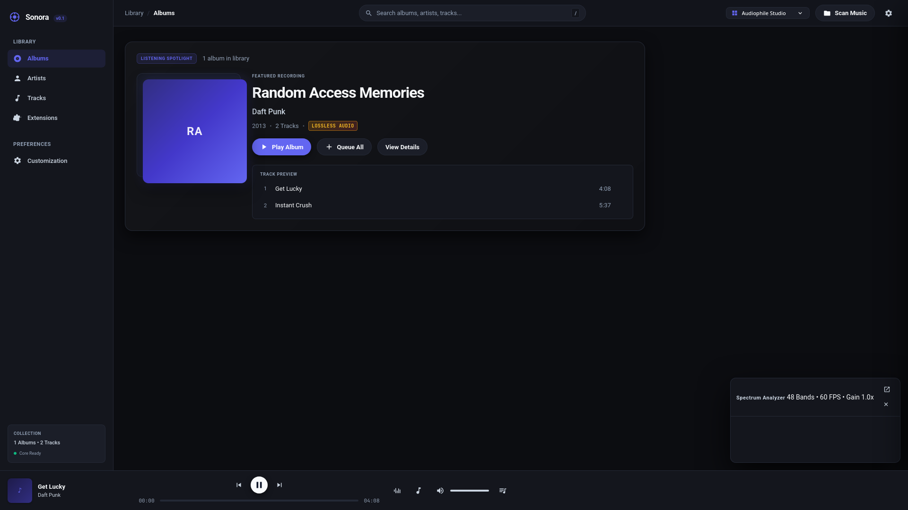
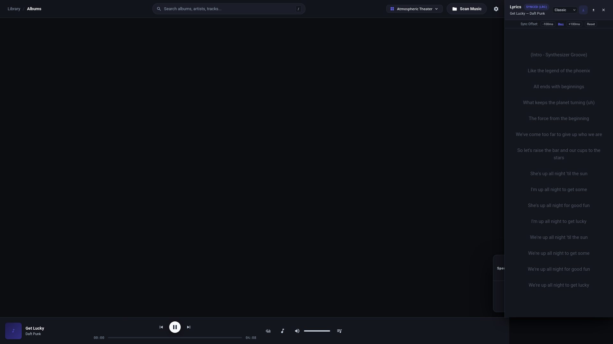
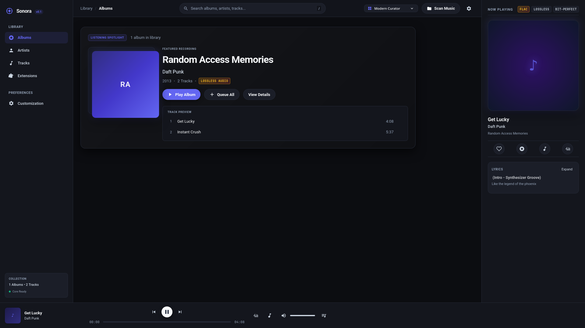
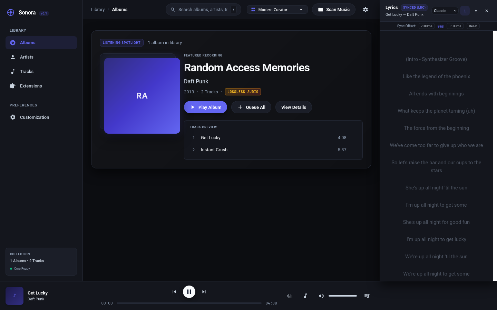
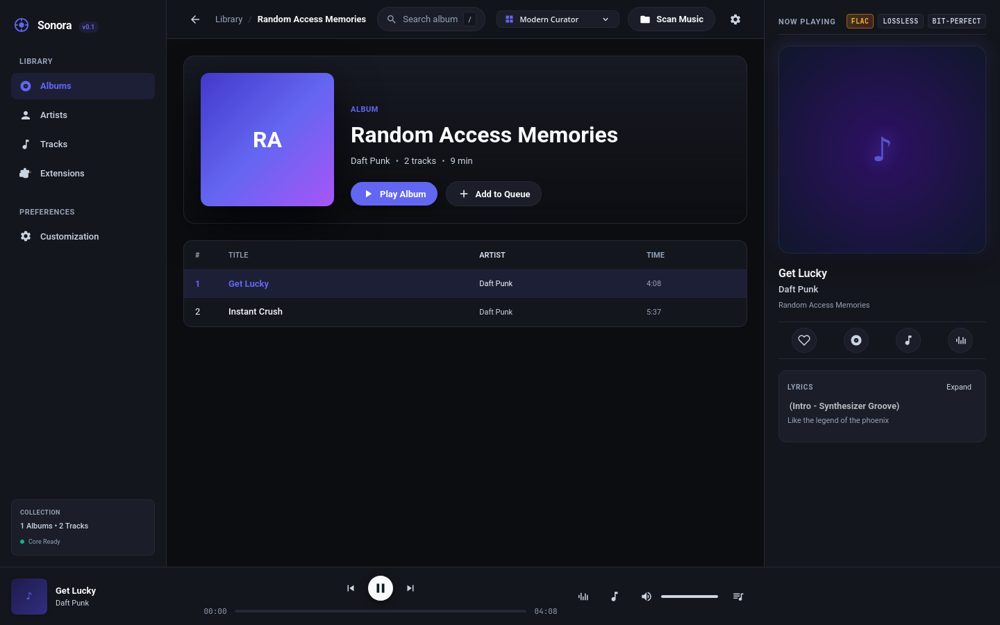
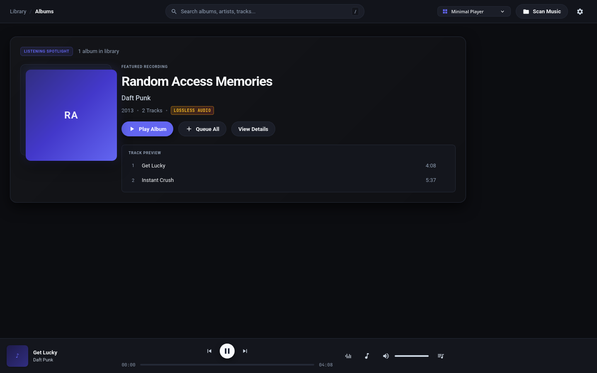

# Sonora

<p align="center">
  <strong>The Sovereign, Bit-Perfect Audiophile Music Player & Instrument</strong>
</p>

<p align="center">
  <a href="https://github.com/Sumeet-basfore/sonora/releases/latest"></a>
  <a href="https://github.com/Sumeet-basfore/sonora/actions"></a>
  <a href="LICENSE-MIT"></a>
  <a href="https://github.com/Sumeet-basfore/sonora"></a>
  <a href="https://github.com/Sumeet-basfore/sonora"></a>
</p>

---

## 🎬 Launch Showcase (20s Video)

https://github.com/Sumeet-basfore/sonora/raw/main/docs/assets/sonora-launch.mp4

<p align="center">
  <video src="https://github.com/Sumeet-basfore/sonora/raw/main/docs/assets/sonora-launch.mp4" poster="docs/assets/sonora-launch-poster.jpg" width="100%" controls autoplay muted loop>
    <a href="https://github.com/Sumeet-basfore/sonora/raw/main/docs/assets/sonora-launch.mp4">
      
    </a>
  </video>
</p>
<p align="center">
  <em>High-resolution 1080p 60 FPS demo showcasing the Audiophile DSP engine, Universal Command Palette, and Synced Lyrics.</em>
</p>

---

## 📸 Workspaces & Interface Showcase

Sonora features **4 modular workspaces** designed for different listening contexts — from deep audiophile analysis to immersive theater view.

### 1. Audiophile Studio & Atmospheric Theater
| **Audiophile Studio** (64-Band Spectrum, 384kHz/32-bit DSP) | **Atmospheric Theater** (Full-Bleed Art & Synced Lyrics) |
| :---: | :---: |
| [](docs/assets/screenshot-audiophile-studio.png) | [](docs/assets/screenshot-atmospheric-theater.png) |

### 2. Modern Curator & Synced Lyrics Engine
| **Modern Curator** (Rich Library & MusicBrainz Enrichment) | **Synced Lyrics View** (`Cmd + L`, Millisecond Precision) |
| :---: | :---: |
| [](docs/assets/screenshot-modern-curator.png) | [](docs/assets/screenshot-lyrics-view.png) |

### 3. Album Detail & Minimal Player
| **Album Deep Dive** (Multi-Provider Artwork & Tracklists) | **Minimal Player** (Distraction-Free Transport) |
| :---: | :---: |
| [](docs/assets/screenshot-album-detail.png) | [](docs/assets/screenshot-minimal-player.png) |

---

## 🌟 What Makes Sonora Different?

Most modern music players have turned into web wrappers for rental streaming services. **Sonora is built on a single core principle: your music collection is a permanent library, and playing it should feel like operating a precision high-end instrument.**

* **Sovereign & Local-First**: No required user accounts, no telemetry, no remote servers phone-home, no paywalls.
* **True Bit-Perfect Pipeline**: Dual-decoder gapless engine (Symphonia + Rubato 64-bit sinc resampler) operating at up to 384kHz / 32-bit float.
* **Decoupled 60 FPS Audio DSP**: Real-time 64-band logarithmic FFT spectrum analyzer running on a dedicated audio thread with lock-free ring buffer IPC (`rtrb`).
* **Universal Command Palette (`Cmd + K` / `/`)**: Sub-5ms instant local library queries via SQLite FTS5 alongside ranked online metadata matching (MusicBrainz, Cover Art Archive, Fanart.tv).
* **Millisecond Synced Lyrics (`Cmd + L`)**: Synchronized word/line scrolling with manual `±10ms` offset stepper and LRCLIB integration.
* **Sandboxed WASM Plugins**: Safe, capability-gated Wasmtime extension runtime. Crashing plugins will never interrupt playback.

---

## 📥 Download Sonora

Pre-built binaries are ready to download and run without compiling or installing developer toolchains.

👉 **[Download Sonora v0.1.0 Releases](https://github.com/Sumeet-basfore/sonora/releases/latest)**

### 🖥️ Desktop Applications
| Platform | Format | Package / Asset Name | Status |
| :--- | :--- | :--- | :--- |
| **Linux (x86_64)** | Universal AppImage | `Sonora-v0.1.0-linux-x86_64.AppImage` | **Primary (Fully Tested)** |
| **Linux (Debian/Ubuntu)** | DEB Package | `Sonora-v0.1.0-linux-x86_64.deb` | **Primary (Fully Tested)** |
| **Windows (x86_64)** | MSI Installer | `Sonora-v0.1.0-windows-x86_64.msi` | Supported |
| **Windows (x86_64)** | Portable Executable | `Sonora-v0.1.0-windows-x86_64.exe` | Supported |
| **macOS (Apple Silicon)** | DMG (Universal/ARM64) | `Sonora-v0.1.0-macos-aarch64.dmg` | Supported |
| **macOS (Intel)** | DMG (x86_64) | `Sonora-v0.1.0-macos-x86_64.dmg` | Supported |

### 📟 Terminal Tools (`sonora` CLI + `sonora-tui`)
Standalone bundles containing `sonora`, `sonora-tui`, and documentation:
* **Linux (x86_64):** `Sonora-v0.1.0-linux-x86_64-terminal.tar.gz`
* **Windows (x86_64):** `Sonora-v0.1.0-windows-x86_64-terminal.zip`
* **macOS (Apple Silicon):** `Sonora-v0.1.0-macos-aarch64-terminal.tar.gz`
* **macOS (Intel):** `Sonora-v0.1.0-macos-x86_64-terminal.tar.gz`

---

## 🚀 Quick Start & Installation

### Linux Desktop GUI
```bash
# AppImage (Universal)
chmod +x Sonora-v0.1.0-linux-x86_64.AppImage
./Sonora-v0.1.0-linux-x86_64.AppImage

# Debian / Ubuntu (.deb)
sudo dpkg -i Sonora-v0.1.0-linux-x86_64.deb
```

### Linux Terminal Tools
```bash
tar -xzf Sonora-v0.1.0-linux-x86_64-terminal.tar.gz
./sonora-tui          # Full-screen interactive TUI
./sonora status       # Scriptable CLI
```

### Windows
1. Download `Sonora-v0.1.0-windows-x86_64.msi` or `.exe`.
2. Run the installer and launch Sonora from your Start Menu.
3. For Terminal tools: extract `Sonora-v0.1.0-windows-x86_64-terminal.zip` and run `.\sonora-tui.exe`.

### macOS
1. Download `Sonora-v0.1.0-macos-aarch64.dmg` (Apple Silicon) or `Sonora-v0.1.0-macos-x86_64.dmg` (Intel).
2. Open the `.dmg` and drag `Sonora.app` into **Applications**.

### Release Integrity
Verify downloaded assets against `checksums.txt`:
```bash
# Linux / macOS
sha256sum -c checksums.txt

# Windows PowerShell
Get-FileHash Sonora-v0.1.0-windows-x86_64.msi -Algorithm SHA256
```

---

## 🎵 Supported Audio Formats

| Format | Extension | Decoder Engine | Metadata Tagging |
| :--- | :--- | :--- | :--- |
| **FLAC** | `.flac` | Symphonia (Bit-Perfect Lossless) | Lofty (Vorbis Comments) |
| **ALAC** | `.m4a`, `.alac` | Symphonia (Apple Lossless) | Lofty (MP4 iTunes Tags) |
| **WAV / AIFF** | `.wav`, `.aif`, `.aiff` | Symphonia (PCM 16/24/32-bit float) | Lofty (RIFF / ID3v2) |
| **MP3** | `.mp3` | Symphonia (MPEG Audio Layer III) | Lofty (ID3v1 / ID3v2.4) |
| **AAC** | `.aac`, `.m4a` | Symphonia (Advanced Audio Coding) | Lofty (MP4 Atoms) |
| **Ogg Vorbis** | `.ogg` | Symphonia (Vorbis Codec) | Lofty (Vorbis Comments) |
| **Opus** | `.opus` | Symphonia (Low-Latency Opus) | Lofty (Opus Tags) |

---

## 🛠️ For Developers: Build From Source

Building from source is completely optional. If you would like to hack on the audio engine or contribute:

### Prerequisites
* Rust stable toolchain (`rustup update stable`)
* Node.js 20+ & npm
* Linux system libraries: `sudo apt-get install -y libasound2-dev libwebkit2gtk-4.1-dev libjavascriptcoregtk-4.1-dev libsoup-3.0-dev`

### Clone & Build
```bash
git clone https://github.com/Sumeet-basfore/sonora.git
cd sonora

# Build entire Rust workspace (audio core, DSP, FTS5 indexer, CLI, TUI, Tauri desktop backend)
cargo build --workspace

# Build modern desktop frontend
npm --prefix apps/desktop install
npm --prefix apps/desktop run build

# Run applications locally
cargo run -p sonora-cli -- status    # Scriptable CLI
cargo run -p sonora-tui              # Interactive TUI
npm --prefix apps/desktop run tauri  # Desktop GUI
```

### Running Test Suite & Quality Checks
```bash
cargo fmt --all -- --check
cargo clippy --workspace --all-targets -- -D warnings
cargo test --workspace
npm --prefix apps/desktop test
```

---

## 🔌 Plugins, Themes & Extensions

* **WASM Plugins**: Sandboxed WebAssembly modules implementing the `sonora_plugin_*` ABI. See [`docs/05-plugin-system.md`](docs/05-plugin-system.md) and [`plugins/example/`](plugins/example/).
* **Theme Customization**: Pure JSON token schemas with hot-reloading CSS textures. See [`docs/06-theming-and-customization.md`](docs/06-theming-and-customization.md) and [`themes/sonora-retro/`](themes/sonora-retro/).
* **Community Registry**: Reproducible manifest format and SHA-256 package registry. See [`community-registry/`](community-registry/).

---

## 📚 Technical Specifications & Documentation

* [System Architecture Specification](docs/04-system-architecture.md)
* [Audio Engine & Real-Time DSP](docs/04-system-architecture.md#audio-engine)
* [Online Metadata & Enrichment Architecture](docs/23-online-metadata.md)
* [Universal Search & Keyboard Palette UX](docs/24-online-search-ux.md)
* [Artwork Retrieval & Multi-Provider Caching](docs/25-artwork-system.md)
* [Synchronized Lyrics Pipeline](docs/26-lyrics-experience.md)
* [Deterministic Metadata Matching & Scoring](docs/27-metadata-matching.md)
* [Architecture Decision Records (ADRs)](docs/12-decision-log.md)

---

## 📄 License

Sonora is dual-licensed under [MIT](LICENSE-MIT) and [Apache-2.0](LICENSE-APACHE).
