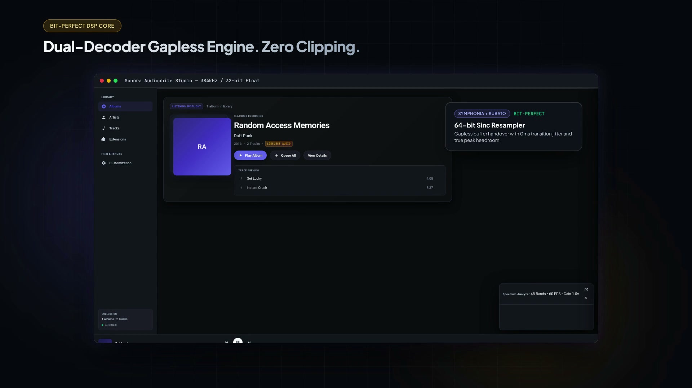

# Sonora

Local-first desktop and terminal music player: a Rust audio engine driving a modern desktop GUI, an interactive terminal UI, and a scriptable CLI. Audiophile-grade playback, synchronized lyrics, dynamic theming, sandboxed WASM plugins, and a community extension marketplace — no accounts, no telemetry, no cloud streaming lock-in.

<p align="center">
  <video src="docs/assets/sonora-launch.mp4" poster="docs/assets/sonora-launch-poster.jpg" width="100%" controls autoplay muted loop>
    <a href="docs/assets/sonora-launch.mp4">
      
    </a>
  </video>
</p>

---

## 📥 Download

Pre-built releases are ready to download and run without compiling or installing developer tools. Compiling Sonora is completely **optional** for normal users.

👉 **[Download Sonora v0.1.0 Releases](https://github.com/Sumeet-basfore/sonora/releases/latest)**

### Desktop Applications
* **Linux (x86_64)** *(Primary — Fully Tested)*
  * Universal AppImage: `Sonora-v0.1.0-linux-x86_64.AppImage`
  * Debian / Ubuntu (.deb): `Sonora-v0.1.0-linux-x86_64.deb`
* **Windows (x86_64)** *(Best-Effort)*
  * MSI Installer: `Sonora-v0.1.0-windows-x86_64.msi`
  * Setup Executable: `Sonora-v0.1.0-windows-x86_64.exe`
* **macOS** *(Best-Effort)*
  * Apple Silicon (M1/M2/M3/M4): `Sonora-v0.1.0-macos-aarch64.dmg`
  * Intel (x86_64): `Sonora-v0.1.0-macos-x86_64.dmg`

### Terminal Tools (`sonora` CLI + `sonora-tui`)
Standalone bundles containing `sonora`, `sonora-tui`, and `README.txt`:
* **Linux (x86_64):** `Sonora-v0.1.0-linux-x86_64-terminal.tar.gz`
* **Windows (x86_64):** `Sonora-v0.1.0-windows-x86_64-terminal.zip`
* **macOS (Apple Silicon):** `Sonora-v0.1.0-macos-aarch64-terminal.tar.gz`
* **macOS (Intel):** `Sonora-v0.1.0-macos-x86_64-terminal.tar.gz`

### Developers
* **[Build from Source](#-for-developers-build-from-source)** *(Optional)*

---

## 🚀 Quick Installation

### Linux Desktop GUI
* **AppImage (Universal):**
  ```sh
  chmod +x Sonora-v0.1.0-linux-x86_64.AppImage
  ./Sonora-v0.1.0-linux-x86_64.AppImage
  ```
* **Debian / Ubuntu (.deb):**
  ```sh
  sudo dpkg -i Sonora-v0.1.0-linux-x86_64.deb
  ```

### Linux Terminal Tools
```sh
tar -xzf Sonora-v0.1.0-linux-x86_64-terminal.tar.gz
./sonora-tui          # Interactive full-screen terminal player
./sonora status       # Scriptable CLI
```

### Windows Desktop GUI
1. Download `Sonora-v0.1.0-windows-x86_64.msi` or `Sonora-v0.1.0-windows-x86_64.exe`.
2. Run the installer and launch Sonora from the Start Menu.

### Windows Terminal Tools
1. Download and extract `Sonora-v0.1.0-windows-x86_64-terminal.zip`.
2. In PowerShell or Command Prompt:
   ```powershell
   .\sonora-tui.exe
   .\sonora.exe status
   ```

### macOS Desktop GUI
1. Download `Sonora-v0.1.0-macos-aarch64.dmg` (Apple Silicon) or `Sonora-v0.1.0-macos-x86_64.dmg` (Intel).
2. Open the `.dmg` and drag `Sonora.app` to **Applications**.
3. *(Note: Because binaries are not yet notarized by Apple, right-click `Sonora.app` and choose **Open** on first launch).*

### macOS Terminal Tools
```sh
tar -xzf Sonora-v0.1.0-macos-*-terminal.tar.gz
./sonora-tui
./sonora status
```

### Checksum Verification
Verify release integrity using `checksums.txt`:
* **Linux / macOS:**
  ```sh
  sha256sum -c checksums.txt
  ```
* **Windows (PowerShell):**
  ```powershell
  Get-FileHash Sonora-v0.1.0-windows-x86_64.msi -Algorithm SHA256
  ```

📖 Comprehensive step-by-step setup and PATH instructions: **[docs/INSTALLATION.md](docs/INSTALLATION.md)**

---

## 🎵 Supported Formats

FLAC, ALAC, WAV, AIFF, MP3, AAC/M4A, Ogg Vorbis — decoded with **Symphonia**, tagged with **Lofty**. Corrupted or unreadable files are logged and skipped safely without stopping library scans.


---

## ✨ Key Features

* **Real-Time Audio Engine** — dedicated audio thread with zero allocation or mutex locking in the CPAL render loop, lock-free ring buffer (`rtrb`), 10-band parametric EQ, and lock-free visualizer taps.
* **Instant Library Search** — SQLite + FTS5 full-text search index, instant fuzzy search over title, artist, album, and genre, automatic album art caching.
* **Synchronized Lyrics** — 5 display modes (Classic, Cinematic, Compact, Minimal, Dual-line), live timing synchronization, click-to-seek, manual offset calibration, and local `.lrc` / LRCLIB cascade.
* **Visualizer Suite** — FFT-based spectrum analysis off the real-time audio thread, frame-rate independent rendering.
* **Customization & Themes** — semantic color tokens, light/dark modes, customizable accent colors, responsive layout toggles, 5 album art display styles.
* **Sandboxed WASM Plugins** — capability-gated Wasmtime sandbox with strict memory and system call constraints; crashing plugins never interrupt playback.
* **Offline-First Marketplace** — Git-backed registry (`community-registry/`) with SHA-256 checksum-verified extensions, rollback, and uninstallation.

---

## 🛠️ For Developers: Build From Source

Building from source is completely optional. If you want to contribute or build locally:

### Prerequisites
* Rust stable toolchain (`rustup update stable`)
* Node.js 20+
* Linux dependencies: `sudo apt-get install -y libasound2-dev libwebkit2gtk-4.1-dev libjavascriptcoregtk-4.1-dev libsoup-3.0-dev`

### Build & Run
```sh
git clone https://github.com/Sumeet-basfore/sonora.git
cd sonora

# Build entire workspace (engine, library, lyrics, plugin host, CLI, TUI, desktop)
cargo build --workspace

# Build desktop frontend
npm --prefix apps/desktop install
npm --prefix apps/desktop run build

# Run applications
cargo run -p sonora-cli -- status    # Scriptable CLI
cargo run -p sonora-tui              # Interactive TUI
npm --prefix apps/desktop run tauri  # Desktop GUI
```

### Running Tests
```sh
cargo fmt --all -- --check
cargo clippy --workspace --all-targets -- -D warnings
cargo test --workspace
npm --prefix apps/desktop test
```

---

## 🔌 Plugin & Theme Development

* **Plugin Architecture:** Sandboxed WASM modules implementing the `sonora_plugin_*` ABI. See [`docs/05-plugin-system.md`](docs/05-plugin-system.md) and [`plugins/example/`](plugins/example/).
* **Theme Development:** Pure JSON token schema + sanitized CSS textures. See [`docs/06-theming-and-customization.md`](docs/06-theming-and-customization.md) and [`themes/sonora-retro/`](themes/sonora-retro/).
* **Community Registry:** Reproducible package generator and manifest schema. See [`community-registry/`](community-registry/).

---

## 📚 Documentation & Roadmap

* [System Architecture Specification](docs/04-system-architecture.md)
* [Plugin System & Sandboxing](docs/05-plugin-system.md)
* [Theming & Design Tokens](docs/06-theming-and-customization.md)
* [Lyrics System Specification](docs/07-lyrics-system.md)
* [Community Marketplace Specification](docs/08-marketplace.md)
* [Security & Permissions Model](docs/09-security-and-permissions.md)
* [Development Roadmap](docs/11-development-roadmap.md)
* [Architecture Decision Records (ADRs)](docs/12-decision-log.md)
* [Release Notes](RELEASE_NOTES.md)

---

## 📄 License

Dual-licensed under [MIT](LICENSE-MIT) or [Apache-2.0](LICENSE-APACHE).
