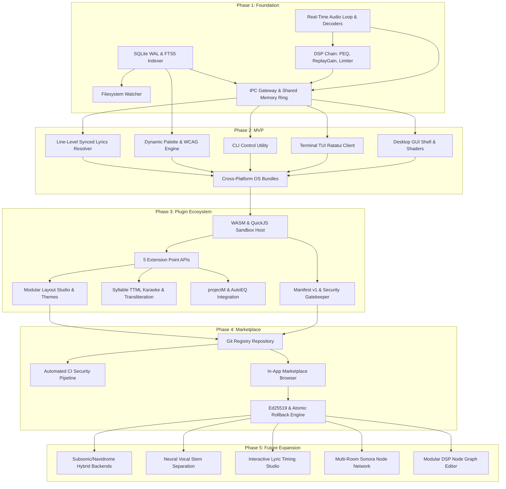

# Sonora: Development Roadmap & Engineering Execution Plan

## 1. Executive Strategy & Milestone Overview

Sonora is engineered as a high-performance, modular desktop audio canvas and daemon. To achieve zero-glitch playback fidelity, sub-millisecond database indexing, aesthetic immersion, and secure extensibility without succumbing to feature bloat, development is structured across five sequential, milestone-driven phases.

```
┌──────────────────────────────────────────────────────────────────────────────────────────────────┐
│                                  SONORA EXECUTION PHASING                                        │
├─────────────────┬─────────────────┬─────────────────┬─────────────────┬──────────────────────────┤
│ PHASE 1         │ PHASE 2         │ PHASE 3         │ PHASE 4         │ PHASE 5                  │
│ FOUNDATION      │ MVP             │ PLUGIN          │ MARKETPLACE     │ FUTURE                   │
│                 │                 │ ECOSYSTEM       │                 │ EXPANSION                │
├─────────────────┼─────────────────┼─────────────────┼─────────────────┼──────────────────────────┤
│ • Headless Core │ • Desktop GUI   │ • WASM/QuickJS  │ • Git Registry  │ • Remote Subsonic/Navi   │
│ • Real-time DSP │ • Terminal TUI  │   Sandbox Host  │ • CI Validation │ • Neural Vocal Stems     │
│ • SQLite + FTS5 │ • Dynamic Theme │ • Manifest v1   │ • 1-Click Store │ • Lyric Timing Studio    │
│ • IPC Engine    │ • Line Synced   │ • Syllable TTML │ • Atomic Roll-  │ • Multi-Room Sonora Node │
│ • Shared SHM Tap│   Lyrics & PEQ  │ • AutoEQ Presets│   back Manager  │ • Modular DSP Node Graph │
└─────────────────┴─────────────────┴─────────────────┴─────────────────┴──────────────────────────┘
```

---

## 2. Phase 1: Foundation (The Bulletproof Core)

### 2.1 Objective
Establish the headless core daemon (`sonorad`), the dedicated lockless real-time audio pipeline, the embedded SQLite WAL indexing database, the low-latency IPC transport layer, and platform-specific audio driver integrations. Guarantee zero audio dropouts under maximum system load.

### 2.2 Dependencies & Prerequisites
- **Language Toolchain**: Rust 1.75+ (Memory safety, real-time thread deterministic guarantees).
- **Core Libraries**: `symphonia` / `lofty` (Audio format decoding & metadata parsing), `rtrb` (Lock-free SPSC ring buffers), `rusqlite` with bundled `FTS5`, `tokio` (Async runtime for background workers & IPC).
- **System Audio Drivers**:
  - Linux: `libpipewire-0.3`, `alsa-lib`, `libpulse`
  - macOS: `CoreAudio`, `AudioUnit`, `AudioQueue`
  - Windows: `WASAPI` (Exclusive & Shared Mode via `windows-rs`)

### 2.3 Key Deliverables & Technical Milestones
```
┌─────────────────────────────────────────────────────────────────────────────┐
│                          PHASE 1 CORE DELIVERABLES                          │
├─────────────────────────────────────────────────────────────────────────────┤
│ 1. Headless Audio Daemon (`sonorad`)                                        │
│    • Real-time audio loop isolated on high-priority thread (SCHED_FIFO/     │
│      MMCSS Pro Audio) with zero allocations, zero mutexes, zero disk I/O.   │
│    • Gapless decoding engine for FLAC, ALAC, WAV, AIFF, MP3, AAC, OGG, Opus.│
│    • Real-time DSP cascade: ReplayGain 2.0 / EBU R128 loudness pre-amp,     │
│      10-band Direct Form II Transposed biquad PEQ, and True-Peak limiter.   │
├─────────────────────────────────────────────────────────────────────────────┤
│ 2. Data & Library Engine                                                    │
│    • SQLite database in WAL mode with normalized relational schema (Tracks, │
│      Albums, Artists, Playlists, Play History, Lyrics Cache, EQ Presets).   │
│    • FTS5 trigram full-text search index delivering sub-5ms queries on 100k+│
│      tracks.                                                                │
│    • Non-blocking filesystem watcher (`notify`) with debounced worker pool  │
│      and mtime/size change-detection filters.                               │
├─────────────────────────────────────────────────────────────────────────────┤
│ 3. Inter-Process Communication (IPC) Gateway                                │
│    • High-speed local transport: Unix Domain Sockets (`mode 0600`) on Linux/│
│      macOS and Named Pipes (`\\.\pipe\sonora-ipc-*`) on Windows.            │
│    • Framed binary message protocol for RPC requests, responses, and events.│
│    • Zero-copy shared memory visualizer ring buffer (`SonoraSharedRing`)    │
│      broadcasting 2048-sample stereo PCM and 256-band FFT data at 120 FPS.  │
├─────────────────────────────────────────────────────────────────────────────┤
│ 4. Deterministic Core Test Harness                                          │
│    • Automated stress tests verifying zero buffer underruns under 100% CPU  │
│      load and simulated disk thrashing.                                     │
│    • Query latency benchmarks validating < 5ms FTS5 search over 100k items. │
└─────────────────────────────────────────────────────────────────────────────┘
```

### 2.4 Risks & Architectural Mitigations
| Risk Description | Severity | Mitigation Strategy |
| :--- | :--- | :--- |
| **Real-time audio thread priority inversion or allocator locks** | **CRITICAL** | Enforce strict compile-time and runtime linting forbidding dynamic allocations (`malloc`/`free`) on the audio loop; communicate with control threads exclusively via lockless SPSC ring buffers (`rtrb`). |
| **IPC transport serialization overhead** | **HIGH** | Separate heavy FFT/audio stream data into a direct memory-mapped shared buffer (`shm_open` / `CreateFileMapping`), reserving socket IPC purely for low-rate discrete commands and events. |
| **Inconsistent cross-platform audio device behaviors** | **HIGH** | Encapsulate output drivers behind a unified `AudioBackend` trait with automated fallback (e.g., PipeWire $\to$ ALSA $\to$ PulseAudio on Linux; WASAPI Exclusive $\to$ Shared on Windows). |

### 2.5 Explicit Out-of-Scope Items
- Graphical user interface rendering or window creation.
- WebAssembly / QuickJS third-party plugin sandbox initialization.
- Syllable-level TTML karaoke rendering.
- Remote server streaming (Subsonic, Navidrome, Jellyfin).
- Community marketplace indexing or package downloading.

---

## 3. Phase 2: MVP (The Immersive Player)

### 3.1 Objective
Deliver a feature-complete, dual-interface music listening experience for audiophiles, aesthetic customizers, and terminal power users. Combine a GPU-accelerated desktop GUI, an ultra-fast terminal TUI, and a scriptable CLI with dynamic album-art theming, line-level synced lyrics, and interactive equalizer controls.

### 3.2 Dependencies & Prerequisites
- **Phase 1 Foundation**: Verified `sonorad` daemon, IPC transport, and SQLite indexer.
- **Frontend Technologies**:
  - Desktop GUI: Hardware-accelerated graphics backend (WGPU / Slint / Native GPU Canvas), WGSL fragment shaders, `image-rs` (safe image decoding).
  - Terminal TUI: `ratatui`, `crossterm`, Unicode/Braille glyph rendering engine.
  - CLI: `clap` command-line argument parser.
- **Color Mathematics**: Perceptual Oklab / HCT color quantization and WCAG 2.1 AA luminance algorithms.
- **Lyrics Providers**: Public LRCLIB API client over HTTPS.

### 3.3 Key Deliverables & Technical Milestones
```
┌─────────────────────────────────────────────────────────────────────────────┐
│                            PHASE 2 MVP DELIVERABLES                         │
├─────────────────────────────────────────────────────────────────────────────┤
│ 1. High-Performance Desktop GUI (`sonora`)                                  │
│    • Modular tri-pane workspace: Library browser, album cover art grid,     │
│      high-density track table, queue manager, and persistent transport dock.│
│    • Real-time album-art palette extraction (< 30ms) extracting Dominant,   │
│      Vibrant, DarkVibrant, and Muted swatches.                              │
│    • WCAG 2.1 AA mathematical contrast enforcement guaranteeing $\ge$ 4.5:1│
│      legibility across all dynamic UI elements.                             │
│    • Multi-pass GPU fragment shader rendering ambient blurred canvas glows. │
│    • Interactive 10-band Parametric Equalizer curve editor with node dragging│
│      and pre-amp peak meters.                                               │
│    • Smooth CAVA-inspired FFT spectrum bars rendering at native display     │
│      refresh rates (60/120/144 Hz).                                         │
├─────────────────────────────────────────────────────────────────────────────┤
│ 2. Terminal TUI Client (`sonora-tui`)                                       │
│    • Lightweight terminal interface (< 15MB RAM) with complete Vim key-     │
│      bindings (`h/j/k/l`, `/` fuzzy search, `Space` toggle, `n/p` queue).   │
│    • Real-time ASCII and Braille frequency spectrum visualizer bars.        │
│    • Split-pane library, queue, track metadata, and synchronized line lyrics│
│      viewports with ANSI color scheme adaptation.                           │
├─────────────────────────────────────────────────────────────────────────────┤
│ 3. CLI Scripting Utility (`sonora-cli`)                                     │
│    • Instantaneous shell commands (`play`, `pause`, `toggle`, `next`, `prev`,│
│      `volume +5`, `seek +10`, `status --json`) for window manager integration.│
├─────────────────────────────────────────────────────────────────────────────┤
│ 4. Synchronized Lyrics Engine (Line-Level)                                  │
│    • Cascading fallback pipeline: Embedded SYLT/USLT tags $\to$ Local .lrc  │
│      sidecars $\to$ SQLite cache $\to$ LRCLIB public API $\to$ Plain text. │
│    • Spring-physics critically damped auto-scrolling with current line      │
│      magnification and past/future line opacity fading.                     │
├─────────────────────────────────────────────────────────────────────────────┤
│ 5. Native OS Integration & Distribution Packages                            │
│    • Media key and lock screen integration: MPRIS2 (Linux), SMTC (Windows), │
│      and `MPNowPlayingInfoCenter` (macOS).                                  │
│    • System tray / menu bar status controls.                                │
│    • Standalone zero-dependency packages: AppImage / Flatpak (Linux),       │
│      `.dmg` (macOS Universal), portable ZIP / MSI (Windows).                │
└─────────────────────────────────────────────────────────────────────────────┘
```

### 3.4 Risks & Architectural Mitigations
| Risk Description | Severity | Mitigation Strategy |
| :--- | :--- | :--- |
| **GPU shader thermal load on low-power laptop batteries** | **MEDIUM** | Implement adaptive shader downsampling and low-power mode fallback (static gradient blur) when running on battery or battery saver profiles. |
| **Extracted palette contrast failures on extreme album art (pure white / pitch black)** | **HIGH** | Apply automated mathematical lightness clamping and chroma attenuation in Oklab color space to strictly enforce a 4.5:1 WCAG contrast ratio. |
| **Terminal TUI rendering lag under rapid resizing or high visualizer FPS** | **MEDIUM** | Decouple TUI draw frames to a capped 30/60 FPS timer while maintaining lockless reads from the shared memory ring buffer. |

### 3.5 Explicit Out-of-Scope Items
- Third-party plugin loading or untrusted sandboxing runtime.
- Decentralized community marketplace or package installation UI.
- projectM / Milkdrop 3 C++ preset visualizers.
- Syllable-by-syllable word-level karaoke typography (Enhanced LRC / TTML).
- Subsonic / Navidrome remote audio backend integration.
- Neural stem separation (vocal isolation).

---

## 4. Phase 3: Plugin Ecosystem & Advanced Media

### 4.1 Objective
Establish an isolated, capability-gated extension system for third-party developers to safely contribute metadata providers, lyrics sources, custom visualizers, dockable UI widgets, and DSP processors without compromising player stability or security. Implement advanced media capabilities including syllable karaoke, AutoEQ profiles, and projectM shaders.

### 4.2 Dependencies & Prerequisites
- **Phase 2 MVP**: Stable daemon, GUI, TUI, and theme token runtime.
- **Sandbox Engines**: `wasmtime` (WebAssembly linear memory sandbox) and `rquickjs` (Isolated QuickJS runtime context).
- **Format Parsers**: TTML XML parser, Enhanced LRC word-timestamp parser, AutoEQ database index.
- **Graphics & Visualizer Bindings**: `libprojectM` C++ FFI wrapper, WGSL/GLSL `naga` shader validator.

### 4.3 Key Deliverables & Technical Milestones
```
┌─────────────────────────────────────────────────────────────────────────────┐
│                       PHASE 3 PLUGIN ECOSYSTEM DELIVERABLES                 │
├─────────────────────────────────────────────────────────────────────────────┤
│ 1. Plugin Sandbox Runtime & Host Supervisor                                 │
│    • Multi-runtime sandbox host: Wasmtime for high-performance DSP/visuals  │
│      and QuickJS for lightweight data fetchers and scriptable hooks.        │
│    • Capability-based security gatekeeper enforcing explicit `manifest.json`│
│      declarations (`network:fetch` with domain whitelists, `library:read`,  │
│      `audio:tap`, `storage:cache`, `filesystem:export`).                    │
│    • Crash isolation and watchdog monitors with fuel-metered WASM execution,│
│      32MB QuickJS memory quotas, and exponential restart backoff.           │
│    • Live hot-reloading (< 50ms) for plugin development and theme swapping.  │
├─────────────────────────────────────────────────────────────────────────────┤
│ 2. Five Core Extension Interfaces                                           │
│    • Metadata Sources: Async hooks for artist bios, art, and tags.          │
│    • Lyrics Providers: Structured query handlers returning AST lines/words. │
│    • Visualizer Nodes: Shared memory audio taps rendering custom shaders.   │
│    • UI Widgets: Declarative virtual DOM slots for custom sidebars and HUDs.│
│    • DSP Processors: Control-plane filter graph hooks with bounded safety.  │
├─────────────────────────────────────────────────────────────────────────────┤
│ 3. State-of-the-Art Syllable Typography & Karaoke                           │
│    • Word/syllable-by-syllable continuous fill animations (Enhanced LRC and │
│      TTML format AST) with sample-accurate audio clock synchronization.     │
│    • Interactive click-to-seek on any word, line, or syllable.              │
│    • Multi-lingual CJK transliteration: Kanji Furigana (`<ruby>`), Romaji,  │
│      Pinyin, and dual-line language translations.                           │
├─────────────────────────────────────────────────────────────────────────────┤
│ 4. Audiophile AutoEQ & projectM Visualizer Studio                           │
│    • Native integration of the AutoEQ repository (5,000+ headphone models)  │
│      with 1-click import of parametric biquad filter curves.                │
│    • projectM (Milkdrop 3) integration rendering classic `.milk` presets at │
│      native display refresh rates with interactive preset switching.        │
├─────────────────────────────────────────────────────────────────────────────┤
│ 5. Modular Docking Workspace & Layout Studio                                │
│    • Recursive JSON layout specification (`layout.json`) supporting visual  │
│      panel resizing, splitting, docking, tab grouping, and floating HUDs.   │
│    • `.sonora-theme` package generator bundling CSS tokens, layouts, and    │
│      custom ambient shaders.                                                │
└─────────────────────────────────────────────────────────────────────────────┘
```

### 4.4 Risks & Architectural Mitigations
| Risk Description | Severity | Mitigation Strategy |
| :--- | :--- | :--- |
| **Sandboxed plugin memory leaks or CPU lockups** | **HIGH** | Bound QuickJS memory to 32MB per plugin instance; enforce instruction fuel metering on Wasmtime; terminate and flag plugins exceeding timeout limits. |
| **Security vulnerabilities from arbitrary URL network calls** | **CRITICAL** | Reject any network request at the host gateway whose target domain is not explicitly declared in `manifest.json` and approved by the user. |
| **FFI instability in `libprojectM` native library** | **HIGH** | Wrap projectM in an isolated rendering process or thread boundary with guard pages and strict exception catching. |

### 4.5 Explicit Out-of-Scope Items
- Decentralized public community registry / package marketplace server.
- Subsonic / Navidrome remote audio backend integration.
- Neural stem separation (vocal removal).
- Multi-room synchronized audio daemon network.

---

## 5. Phase 4: Decentralized Marketplace & Distribution

### 5.1 Objective
Deploy a decentralized, Git-backed community discovery, installation, and update platform for Sonora plugins and themes. Ensure cryptographically verified package integrity, automated security scanning, and zero centralized platform lock-in.

### 5.2 Dependencies & Prerequisites
- **Phase 3 Extension Architecture**: Standardized `manifest.json` v1 schema, plugin sandbox supervisor, and `.sonora-theme` bundle specification.
- **Cryptographic Tools**: `ed25519-dalek` (Signature verification), `sha2` (SHA-256 hash checks).
- **Infrastructure**: GitHub Actions CI runners, Fastly / Cloudflare CDN edge distribution.

### 5.3 Key Deliverables & Technical Milestones
```
┌─────────────────────────────────────────────────────────────────────────────┐
│                        PHASE 4 MARKETPLACE DELIVERABLES                     │
├─────────────────────────────────────────────────────────────────────────────┤
│ 1. Git-Backed Community Registry Repository                                 │
│    • Open-source GitHub registry (`sonora-audio/community-registry`) hosting│
│      versioned catalog indices (`plugins.json`, `themes.json`).             │
│    • Automated CDN edge deployment via Cloudflare/Fastly to global endpoints│
│      (`https://registry.sonora.audio/v1/plugins.json`).                     │
├─────────────────────────────────────────────────────────────────────────────┤
│ 2. Automated Submission & Verification CI Pipeline                          │
│    • Pull request validation runner performing:                             │
│      1. Manifest JSON schema validation and SemVer hierarchy verification.  │
│      2. SHA-256 asset checksum calculation and HTTPS URL verification.      │
│      3. Static code analysis scanning for forbidden globals (`eval`, etc.). │
│      4. Automated headless execution test in a sandboxed CI environment.    │
├─────────────────────────────────────────────────────────────────────────────┤
│ 3. In-App Marketplace Browser (GUI & TUI)                                   │
│    • Interactive discovery view with category filtering, search, and dynamic│
│      popularity/star sorting.                                               │
│    • 1-Click Install, background auto-update checks, and non-destructive    │
│      atomic rollbacks to previous stable versions (`.backup/` folder).      │
│    • Clear, human-readable capability permission prompts prior to package   │
│      unpacking.                                                             │
├─────────────────────────────────────────────────────────────────────────────┤
│ 4. Cryptographic Integrity & Private Registry Support                       │
│    • Verification of author Ed25519 digital signatures and SHA-256 digests. │
│    • Custom registry URL configuration for private enterprise / local Gitea │
│      instances.                                                             │
│    • Air-gapped offline installation via `sonora-cli plugin install <file>`.│
└─────────────────────────────────────────────────────────────────────────────┘
```

### 5.4 Risks & Architectural Mitigations
| Risk Description | Severity | Mitigation Strategy |
| :--- | :--- | :--- |
| **Malicious updates pushed to third-party GitHub releases** | **CRITICAL** | Require SHA-256 immutability in the registry index; prompt user with re-approval dialogue whenever a plugin update requests new permission capabilities. |
| **CDN cache inconsistency or registry index corruption** | **MEDIUM** | Implement client-side schema validation on the fetched index with fallback to secondary CDN mirrors or direct GitHub raw endpoints. |
| **GitHub API rate limiting on client update checks** | **LOW** | Cache registry indices locally for 4 hours; distribute static JSON files through CDN edge caching rather than raw GitHub API calls. |

### 5.5 Explicit Out-of-Scope Items
- Paid / commercial app store monetization or proprietary licensing gateways.
- Neural audio processing (demucs stem separation).
- Subsonic / Navidrome streaming backends.
- Multi-room audio hardware streaming.

---

## 6. Phase 5: Future Expansion (The Connected Audio Ecosystem)

### 6.1 Objective
Evolve Sonora into a living audio platform by integrating remote streaming server sources, local neural vocal separation for karaoke, interactive lyric timing contribution tools, and synchronized multi-room daemon networking.

### 6.2 Dependencies & Prerequisites
- **Phase 4 Marketplace & Stable Core**: Robust extension runtime, active community registry, and proven client-daemon architecture.
- **Neural Inference Engine**: `ort` (ONNX Runtime bindings) or Apple CoreML for optimized local neural model execution.
- **Network Sync Protocols**: Precision Time Protocol (PTP) / clock synchronization algorithms for local network audio distribution.

### 6.3 Key Deliverables & Technical Milestones
```
┌─────────────────────────────────────────────────────────────────────────────┐
│                     PHASE 5 FUTURE EXPANSION DELIVERABLES                   │
├─────────────────────────────────────────────────────────────────────────────┤
│ 1. Remote Audio Backend Providers                                           │
│    • First-class integration with OpenSubsonic, Navidrome, and Jellyfin     │
│      remote media servers.                                                  │
│    • Unified hybrid indexing: Remote tracks, albums, and playlists indexed  │
│      directly into the local SQLite FTS5 search database with smart caching.│
├─────────────────────────────────────────────────────────────────────────────┤
│ 2. Neural Vocal Isolation & Karaoke Stem Engine                             │
│    • Local neural network inference (Demucs / Spleeter lightweight ONNX     │
│      models) executed on CPU/GPU hardware acceleration.                     │
│    • Real-time vocal attenuation slider ("Apple Sing" paradigm) for karaoke │
│      sing-along listening with synchronized syllable lyrics.                │
├─────────────────────────────────────────────────────────────────────────────┤
│ 3. Interactive Lyric Timing & Contribution Studio                           │
│    • In-app visual wave-scrub lyric editor with real-time audio timestamping│
│      and tap-to-sync recording.                                             │
│    • 1-Click authenticated submission of community-synced lyrics to LRCLIB. │
├─────────────────────────────────────────────────────────────────────────────┤
│ 4. Multi-Room Sonora Daemon Network (Sonora Node)                           │
│    • Headless daemon-to-daemon audio streaming across local network nodes   │
│      (Raspberry Pi endpoints, living room DACs, desktop workstations).      │
│    • Sub-millisecond clock synchronization (PTP) for synchronized multi-room│
│      lossless playback.                                                     │
├─────────────────────────────────────────────────────────────────────────────┤
│ 5. Advanced Modular DSP Node Graph                                          │
│    • Visual node-based audio graph editor allowing arbitrary DSP routing    │
│      (Convolution IR reverbs, crossfeed, tube saturators, spatializers).    │
│    • Out-of-process sandboxed VST3 audio plugin bridge.                     │
└─────────────────────────────────────────────────────────────────────────────┘
```

### 6.4 Risks & Architectural Mitigations
| Risk Description | Severity | Mitigation Strategy |
| :--- | :--- | :--- |
| **High CPU/RAM utilization from neural model inference** | **HIGH** | Run stem separation in background thread pools; pre-compute and cache vocal stems on disk; provide lower-complexity quantized models for low-power hardware. |
| **Multi-room audio clock drift across heterogeneous devices** | **HIGH** | Implement PTP clock synchronization with adaptive ring buffer resamplers to adjust fractional drift without audible pitch shifting. |
| **Protocol drift across diverse Subsonic server implementations** | **MEDIUM** | Implement strict OpenSubsonic specification test suites with compatibility shims for legacy server quirks. |

### 6.5 Explicit Out-of-Scope Items
- Decrypting or ripping proprietary DRM streams (Spotify, Apple Music, Tidal).
- Proprietary cloud locker hosting or recurring cloud storage subscriptions.
- Social feeds, user comment sections, or ad networks.
- Full Digital Audio Workstation (DAW) multitrack recording and MIDI editing.

---

## 7. Cross-Phase Dependency & Precedence Graph



---

## 8. Summary Traceability Matrix

| Phase | Milestone Name | Primary User Persona Impact | Target Deliverable Artifacts | Hard Quality Gates |
| :--- | :--- | :--- | :--- | :--- |
| **Phase 1** | **Foundation** | Audiophile Collector, Terminal Minimalist | `sonorad`, Audio Pipeline, SQLite Schema, IPC Sockets | 0 buffer underruns; < 5ms 100k-track search; 0 allocations in audio thread. |
| **Phase 2** | **MVP** | Aesthetic Customizer, Audiophile, Hacker | `sonora` GUI, `sonora-tui`, `sonora-cli`, LRC Resolver | Cold start < 150ms GUI, < 30ms TUI; 100% WCAG 2.1 AA compliance; < 80MB GUI RAM. |
| **Phase 3** | **Plugin Ecosystem** | Plugin Developer, Karaoke Enthusiast | Sandbox Host, Manifest v1, TTML Syllable Engine, Layout Studio | 100% crash isolation (zero daemon crash from plugin fault); < 50ms hot-reload. |
| **Phase 4** | **Marketplace** | Community Creators & End Users | `community-registry`, Submission CI, Marketplace Browser | 100% SHA-256 verification; automated security CI scanning; zero telemetry. |
| **Phase 5** | **Future Expansion** | Multi-Device Power Users, Audiophile Purists | Subsonic Client, Neural Stem Isolator, Sonora Node PTP | Real-time stem separation without audio dropout; < 1ms multi-room clock sync. |
